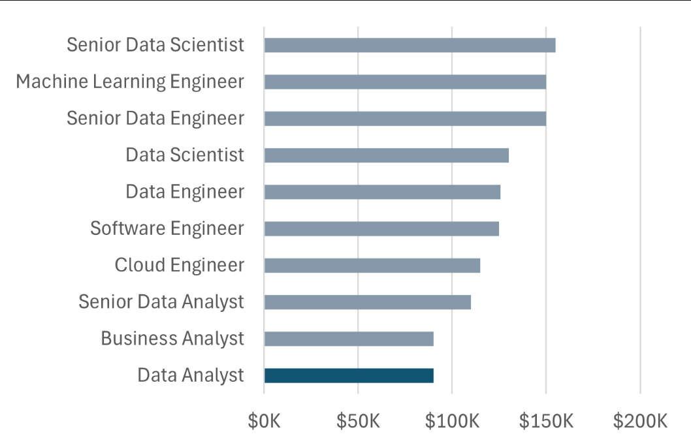

# Excel Salary Calculator Dashboard


## Introduction
This data jobs salary dashboard is built using Microsoft Excel and Power Query to help job seekers investigate salaries for their desired jobs and ensure they are being adequately compensated.

The data is from an Excel course, which provides a foundation in analyzing data using this powerful tool. The data contains detailed information on job titles, salaries, locations, and essential skills that are presented here.

### Dashboard File
You can see my final dashboard here- [Download Excel Salary Dashboard](Excel-Salary-Dasboard.xlsx.xlsx)

### Excel Skills
The following Excel skills were utilized for analysis:

* 📉 Charts
* 🧮 Formulas and Functions
* ❎ Data Validation

### Detailed Indformation
This includes detailed information about:

* 👨‍💼 Job titles
* 💰 Salaries
* 📍 Locations
* 🛠️ Skills

## Dashboard Build
### 📉 Charts
#### 📊 Data Science Job Salaries - Bar Chart

* 🛠️ Excel Features: Utilized bar chart feature (with formatted salary values) and optimized layout for clarity.
* 🎨 Design Choice: Horizontal bar chart for visual comparison of median salaries.
* 📉 Data Organization: Sorted job titles by descending salary for improved readability.
* 💡 Insights Gained: This enables quick identification of salary trends, noting that Senior roles and Engineers are higher-paying than Analyst roles.

#### 🗺️ Country Median Salaries - Map Chart


* 🛠️ Excel Features: Utilized Excel's map chart feature to plot median salaries globally.
* 🎨 Design Choice: Color-coded map to visually differentiate salary levels across regions.
* 📊 Data Representation: Plotted median salary for each country with available data.
* 👁️ Visual Enhancement: Improved readability and immediate understanding of geographic salary trends.
* 💡 Insights Gained: Enables quick grasp of global salary disparities and highlights high/low salary regions.

### 🧮 Formulas and Functions
#### 💰 Median Salary by Job Titles

```excel
=MEDIAN(
IF(
    (jobs[job_title_short]=A2)*
    (jobs[job_country]=country)*
    (ISNUMBER(SEARCH(type,jobs[job_schedule_type])))*
    (jobs[salary_year_avg]<>0),
    jobs[salary_year_avg]
)
)
```
